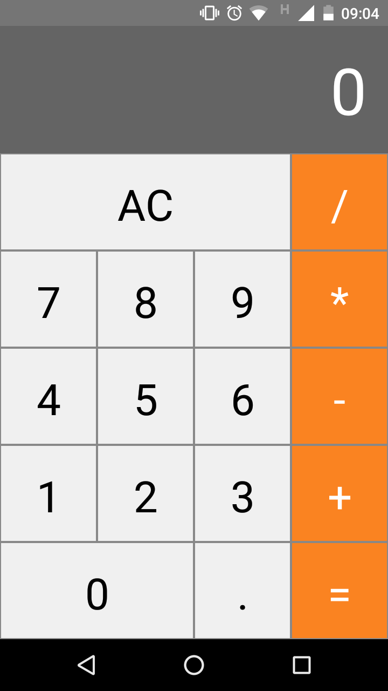

# Calculator

Calculadora feita em react-native com operações básicas de soma, subtração, divisão e multiplicação.



## Instalação

Use o gerenciador de pacotes [yarn](https://classic.yarnpkg.com/en/docs/install) ou [npm](https://www.npmjs.com/) para instalar as dependências.

```bash
yarn install
```

## Iniciando o projeto no android.

```bash
yarn android

yarn start
```

## Iniciando o projeto no ios.

```bash
yarn ios

yarn start
```

## Contribuindo
Solicitações pull são bem-vindas. Para grandes mudanças, abra um problema primeiro para discutir o que você gostaria de mudar.

Atualizamos os testes conforme apropriado.

## License
[MIT](https://choosealicense.com/licenses/mit/)